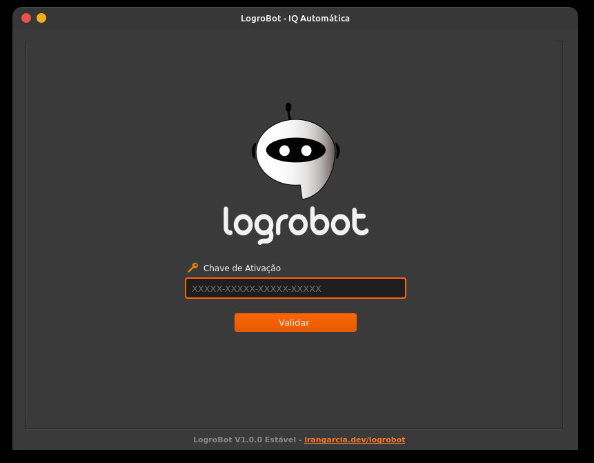
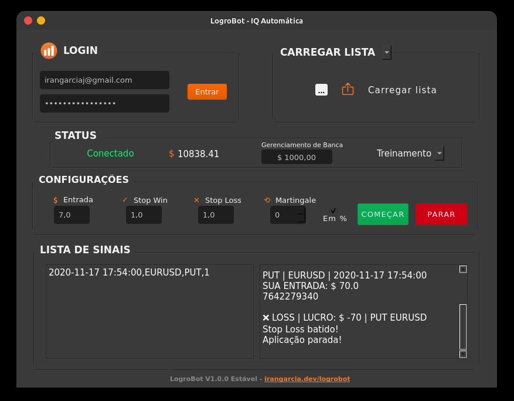

<h1 align="center"> 
🤖 LogroBot</h1>

## 📃 Sobre

LogroBot é uma aplicação automatizadora de entradas na plataforma IQ Option, corretora de opções binárias. Existem duas opções de automatização: a primeira onde um arquivo no formato ```.txt``` é lido e o Bot segue as entradas de acordo com as orientações dadas e o CopyTrade, onde a aplicação dá as entradas de acordo com os Top do Ranking da IQ. **(COPYTADE DESCONTINUADO POR CONTA DE MUDANÇA NA API DA IQ)** Possui funcionalidades como Stop Win, Stop Loss, MartinGale e Gerenciamento de Banca.

## 💻 Tecnologias

- Python
- PyQt5 (GUI)

## 🎨 Layout



